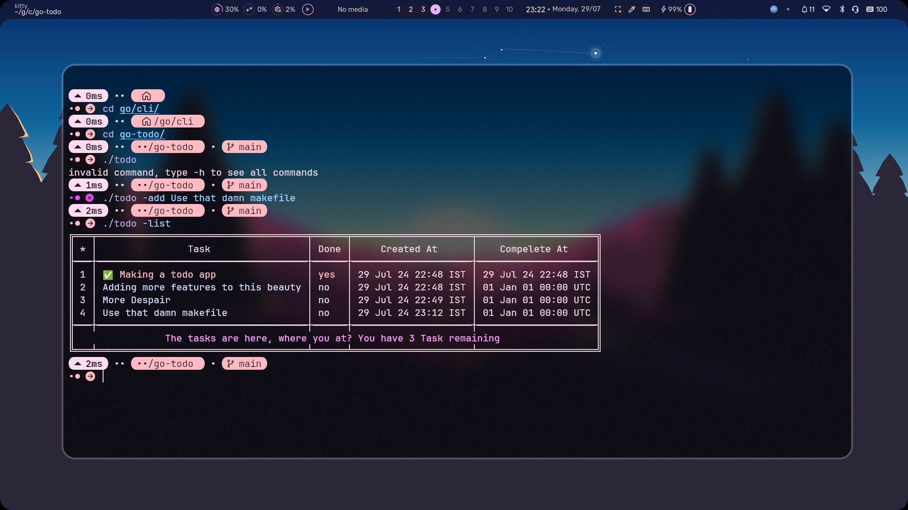

# TaskList

## Basic Todolist App made in Golang
## To Install it:
### 1) Installing using Make
```

       git clone https://github.com/SyedAsadK/TaskList
    
       cd TaskList 

       sudo make install

```
_sudo is important to install_

### 2) Building it for portable install 

```
       git clone https://github.com/SyedAsadK/TaskList
    
       cd TaskList 
        
       make build

```

## To run the app ./todo in same directory

## Usage of TaskList:

  ```
  -add
    	add a new task
  -del int
    	deletes a task
  -done int
    	mark a task as completed
  -list
    	List all tasks

 ```

## Showcase

